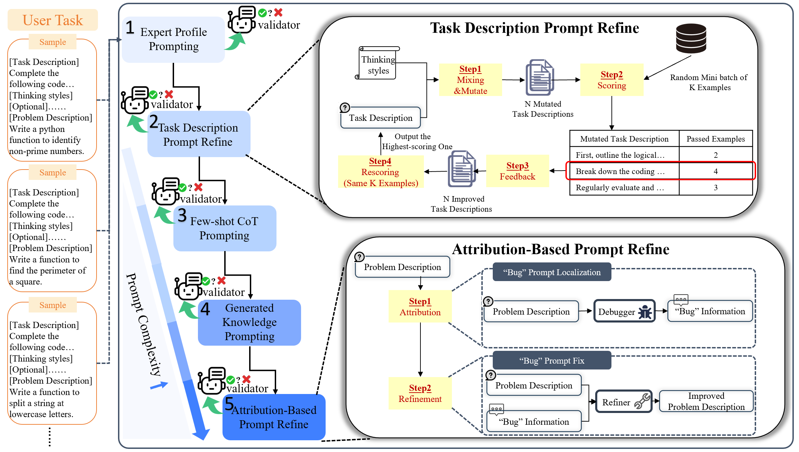

# HPO: A Hierarchical Prompt Optimization Framework with Task Awareness and Fine-Grained Debugging


This repository contains implementation of our paper [HPO: A Hierarchical Prompt Optimization Framework with Task Awareness and Fine-Grained Debugging.]()



## Installation

Follow these steps to set up the development environment and install the package:

- Clone the repository
    ```
    git clone git@github.com:Anonymous5857/HPO.git
    cd HPO
    ```
- Create env and download all the packages required as follows:

  ```
  conda env create -f environment.yml
  conda activate hpo
  ```

## Configurations
  - Use ```promptopt_config.yaml``` to set configurations. We provide default configurations for each task. For example for MBPP this [file](demos/code_generation/configs/promptopt_config.yaml) can be used
  - Use ```.env``` to set environmental varibles. For MBPP this [file](demos/code_generation/.env) can be used

  ```
  USE_OPENAI_API_KEY="XXXX"           # Set to True/False to indicate whether to use OpenAI API key
  OPENAI_API_KEY="XXXX"               # Your actual OpenAI API key
  OPENAI_MODEL_NAME="XXXX"            # The name of the OpenAI model to use (e.g., gpt-4, gpt-3.5-turbo)
  USE_DEEPSEEK_API_KEY="XXXX"         # Set to True/False to indicate whether to use DeepSeek API key
  DEEPSEEK_API_KEY="XXXX"             # Your actual DeepSeek API key
  DEEPSEEK_MODEL_NAME="XXXX"          # The name of the DeepSeek model to use (e.g., deepseek-v3)
  DEEPSEEK_BASE_URL="XXXX"            # The base URL for DeepSeek API (if using a custom endpoint)
  ```
## Running on code generation tasks

### Data Preparation  
  We provide the MBPP dataset under the `code_generation` directory.
### Run the Code  
  ```bash
  cd demos/code_generation
  python mbpp_code_gen.py
  ```

## Running on arithmetic reasoning tasks

### Data Preparation  
First, navigate to the arithmetic_reasoning directory:

```
cd demos/arithmetic_reasoning
```
For each task (aquarat, gsm8k, svamp), prepare the corresponding dataset inside its data directory. The data should be formatted as follows:
```
JSON Format:
{
  "question": "Janet’s ducks lay 16 eggs per day. She eats three for breakfast every morning and bakes muffins for her friends every day with four. She sells the remainder at the farmers' market daily for $2 per fresh duck egg. How much in dollars does she make every day at the farmers' market?",
  "final_answer": "18"
}
```
Make sure to save the processed data as test.jsonl and train.jsonl files in the respective data folders.

### Run the Code
To run the arithmetic reasoning script:
```
cd demos/arithmetic_reasoning
python arithmetic_reasoning.py
```

## Running on sentiment analysis tasks

### Data Preparation  
First, navigate to the sentiment_analysis directory:

```
cd demos/sentiment_analysis
```
For each task (sst2, sst5) prepare the corresponding dataset inside its data directory. The data should be formatted as follows:
```
JSON Format:
{
  "question": "it 's a charming and often affecting journey.",
  "label": 1,
  "final_answer": "positive"
}
```
Make sure to save the processed data as sst2_test.jsonl/sst5_test.jsonl and sst2_train.jsonl/sst5_train.jsonl files in the respective data folders.

### Run the Code
To run the sst2 script:
```
cd demos/sentiment_analysis/sst2
python sst2_task.py
```

To run the sst5 script:
```
cd demos/sentiment_analysis/sst5
python sst5_task.py
```

## Running on instruction induction tasks

### Data Preparation  
First, navigate to the instruction_induction directory:

```
cd demos/instruction_induction
```
For each task, prepare the corresponding dataset inside its specific subtask `data` directory.  
An example of the file directory structure is as follows:
```
instruction_induction
└── data
├── antonyms
│ ├── test.jsonl
│ └── train.jsonl
├── auto_categorization
│ ├── test.jsonl
│ └── train.jsonl
...
```
Each `.jsonl` file should be formatted as follows:

```
JSON Format:
{
  "question": "xxxx",
  "final_answer": "xxxx"
}
```

### Run the Code
To run the instruction induction script:
```
cd demos/instruction_induction
python instruction_induction_task.py
```
